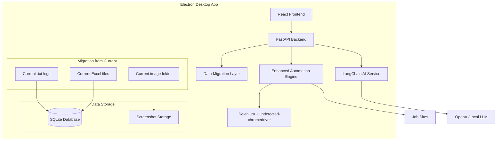

# Desktop Application Transformation Design

## Overview

This design transforms the existing Python job hunting automation script into a production-grade desktop application accessible to non-technical users. The architecture provides a modern graphical user interface with real-time control capabilities, comprehensive monitoring, and professional user experience while maintaining the core automation functionality. The design prioritizes ease of installation, intuitive configuration, and robust error handling to meet the needs of users without technical expertise.

## Architecture

### High-Level Architecture



### Technology Stack for Production-Grade Application

**Self-Contained Desktop Application:**
- **Frontend**: React with modern UI components (bundled in Electron)
- **Backend**: FastAPI (converted from existing Python script)
- **Communication**: REST API + WebSocket for real-time updates
- **Automation**: Enhanced Selenium + undetected-chromedriver
- **AI Integration**: LangChain with OpenAI/local LLM for external job sites
- **Database**: SQLite (bundled) - migrate from Excel/txt files
- **Packaging**: Electron + PyInstaller for single executable installer
- **Distribution**: Cross-platform installers (Windows .exe, macOS .app, Linux .deb/.AppImage)

**Design Rationale:**
- **Single Executable Approach**: Eliminates technical setup requirements (Requirement 1.1, 1.2)
- **Cross-Platform Support**: Ensures accessibility across Windows, macOS, and Linux (Requirement 1.1)
- **Embedded Dependencies**: Bundles Python runtime and all libraries to avoid dependency issues (Requirement 1.2)
- **SQLite Integration**: Provides reliable data persistence with automatic backup capabilities (Requirement 4.2)

**Migration Strategy:**
- Convert current txt logs → SQLite logging table with 30-day retention (Requirement 5.4)
- Convert Excel job history → SQLite jobs table with 90-day historical data (Requirement 4.2)
- Convert image folder → organized file structure with SQLite metadata
- Wrap existing automation logic in FastAPI endpoints with real-time monitoring
- Build React UI with comprehensive dashboard and control capabilities

## Components and Interfaces

### 1. React Frontend (Electron Wrapper)

**Responsibilities:**
- Intuitive, non-technical user interface with guided setup (Requirement 1.3)
- Real-time automation controls with 2-second response time (Requirement 3.1)
- Comprehensive progress monitoring with 30-second update intervals (Requirement 4.5)
- Tabbed configuration interface for easy navigation (Requirement 2.1)
- Built-in help documentation and tutorial videos (Requirement 5.5)
- Professional dashboard with exportable reports (Requirement 4.4)

**Key React Components:**
- `WelcomeScreen`: Initial setup guide for new users (Requirement 1.3)
- `Dashboard`: Real-time status monitor with statistics and progress (Requirement 4.1, 4.5)
- `ControlPanel`: Automation controls with pause/resume/stop functionality (Requirement 3.1, 3.3, 3.5)
- `ConfigurationTabs`: Tabbed settings interface with validation (Requirement 2.1, 2.2)
- `ProfileManager`: Multiple configuration profile support (Requirement 2.5)
- `HistoryViewer`: 90-day historical data with export capabilities (Requirement 4.2, 4.4)
- `ErrorHandler`: User-friendly error display with guided troubleshooting (Requirement 5.1, 5.3)
- `LogViewer`: 30-day log retention with search and filtering (Requirement 5.4)
- `HelpSystem`: Integrated documentation and tutorials (Requirement 5.5)

**Design Rationale:**
- **Tabbed Interface**: Reduces cognitive load for non-technical users (Requirement 2.1)
- **Real-time Updates**: WebSocket integration ensures responsive user experience (Requirement 3.1, 4.5)
- **Guided Setup**: Welcome screen eliminates technical barriers (Requirement 1.3)
- **Visual Feedback**: Progress indicators and status displays provide clear automation state (Requirement 4.1)

### 2. FastAPI Backend

**Responsibilities:**
- Convert existing Python script logic into API endpoints
- Handle automation session management with threading
- Migrate file-based storage to SQLite database
- Provide WebSocket for real-time UI updates
- Integrate LangChain for AI-powered job site adaptation

**API Endpoints:**
```python
# Automation Control
POST /api/automation/start
POST /api/automation/pause  
POST /api/automation/resume
POST /api/automation/stop
GET /api/automation/status

# Job History (migrated from Excel)
GET /api/jobs/history
GET /api/jobs/{job_id}
POST /api/jobs/export

# Configuration
GET /api/config
PUT /api/config
GET /api/config/profiles

# Logs (migrated from txt files)
GET /api/logs
GET /api/logs/download

# Screenshots
GET /api/screenshots
GET /api/screenshots/{filename}

# WebSocket
WS /ws/automation-updates
```

### 3. Enhanced Automation Engine

**Responsibilities:**
- Execute job automation with real-time control capabilities (Requirement 3.1)
- Provide automatic retry mechanisms with exponential backoff (Requirement 5.2)
- Handle website changes gracefully with user-friendly error reporting (Requirement 5.1)
- Support runtime modification of automation parameters (Requirement 3.4)
- Generate detailed progress statistics and completion estimates (Requirement 4.1, 4.5)

**Key Classes:**
- `AutomationController`: Main orchestrator with 2-second response time for controls (Requirement 3.1)
- `SessionManager`: Handles pause/resume/stop with safe state management (Requirement 3.3, 3.5)
- `ErrorHandler`: Implements retry logic and user-friendly error messages (Requirement 5.1, 5.2)
- `ProgressTracker`: Real-time statistics and completion time estimation (Requirement 4.1, 4.5)
- `ConfigurationManager`: Runtime settings modification during active sessions (Requirement 3.4)
- `SafeTerminator`: Ensures clean browser session closure on stop requests (Requirement 3.5)

**Design Rationale:**
- **Responsive Controls**: 2-second response requirement drives asynchronous architecture (Requirement 3.1)
- **Safe State Management**: Pause functionality completes current action before halting (Requirement 3.3)
- **Retry Logic**: Automatic recovery reduces user intervention needs (Requirement 5.2)
- **Progress Estimation**: Statistical analysis provides accurate completion times (Requirement 4.5)

### 4. Session Manager

**Responsibilities:**
- Track automation session state with real-time progress updates (Requirement 4.1)
- Implement pause/resume functionality with 2-second response time (Requirement 3.1, 3.3)
- Persist session data for 90-day historical tracking (Requirement 4.2)
- Coordinate safe termination of browser sessions (Requirement 3.5)
- Generate exportable reports in PDF and CSV formats (Requirement 4.4)

**State Management:**
```python
class SessionState(Enum):
    IDLE = "idle"
    RUNNING = "running"
    PAUSED = "paused"
    STOPPING = "stopping"
    COMPLETED = "completed"
    ERROR = "error"
```

**Design Rationale:**
- **State Persistence**: SQLite storage ensures 90-day data retention (Requirement 4.2)
- **Safe Transitions**: State machine prevents invalid operations during automation (Requirement 3.3, 3.5)
- **Export Capabilities**: Built-in report generation meets user record-keeping needs (Requirement 4.4)
- **Real-time Updates**: WebSocket integration provides immediate status feedback (Requirement 4.1)

### 5. Configuration System

**Responsibilities:**
- Provide tabbed settings interface with intuitive navigation (Requirement 2.1)
- Validate input with 1-second feedback response time (Requirement 2.2)
- Auto-save changes within 2 seconds of modification (Requirement 2.3)
- Support multiple named configuration profiles (Requirement 2.5)
- Handle import/export functionality for backup and sharing (Requirement 2.4)
- Store data in user-accessible locations with organized structure (Requirement 1.4)

**Configuration Schema:**
```json
{
  "profile_name": "string",
  "job_preferences": {
    "keywords": ["string"],
    "locations": ["string"],
    "experience_level": "string",
    "salary_range": {"min": "number", "max": "number"}
  },
  "automation_settings": {
    "delay_between_actions": "number",
    "max_applications_per_session": "number",
    "auto_pause_on_errors": "boolean"
  },
  "browser_settings": {
    "headless_mode": "boolean",
    "user_agent": "string",
    "proxy_settings": "object"
  }
}
```

**Design Rationale:**
- **Tabbed Interface**: Organizes complex settings into manageable sections (Requirement 2.1)
- **Real-time Validation**: Immediate feedback prevents configuration errors (Requirement 2.2)
- **Auto-save**: Eliminates data loss from forgotten saves (Requirement 2.3)
- **Profile Management**: Multiple strategies support different job search approaches (Requirement 2.5)
- **Accessible Storage**: Configuration files stored in standard user directories (Requirement 1.4)

## Data Models

### Session Model
```python
class AutomationSession:
    id: str
    profile_name: str
    start_time: datetime
    end_time: Optional[datetime]
    state: SessionState
    jobs_processed: int
    applications_submitted: int
    success_rate: float  # For effectiveness tracking (Requirement 4.1)
    errors_encountered: List[ErrorLog]
    current_action: str
    progress_percentage: float
    estimated_completion: datetime  # Updated every 30 seconds (Requirement 4.5)
```

### Configuration Model
```python
class UserConfiguration:
    id: str
    profile_name: str
    job_preferences: JobPreferences
    automation_settings: AutomationSettings
    browser_settings: BrowserSettings
    created_at: datetime
    updated_at: datetime
    is_active: bool  # For profile management (Requirement 2.5)
```

### Progress Model
```python
class ProgressUpdate:
    session_id: str
    timestamp: datetime
    current_action: str
    jobs_processed: int
    applications_submitted: int
    estimated_completion: datetime  # Updated every 30 seconds (Requirement 4.5)
    status_message: str
    success_rate: float  # Real-time effectiveness metrics (Requirement 4.1)
```

### Historical Data Model
```python
class HistoricalData:
    id: str
    date: datetime
    daily_applications: int
    daily_jobs_viewed: int
    success_rate: float
    session_duration: int
    # Supports 90-day retention requirement (Requirement 4.2)
```

**Design Rationale:**
- **Success Rate Tracking**: Enables effectiveness monitoring for informed decisions (Requirement 4.1)
- **Completion Estimation**: Real-time calculation supports user planning (Requirement 4.5)
- **Historical Retention**: 90-day data storage meets reporting requirements (Requirement 4.2)
- **Profile Management**: Active profile tracking supports multiple strategy workflows (Requirement 2.5)

## Error Handling

### Error Categories
1. **Network Errors**: Connection timeouts, DNS failures
2. **Website Changes**: Element not found, layout changes (Requirement 5.1)
3. **Authentication Issues**: Login failures, session expiration
4. **Rate Limiting**: Too many requests, temporary blocks
5. **Configuration Errors**: Invalid settings, missing required fields

### Error Recovery Strategy
- **Automatic Retry**: Exponential backoff up to 3 attempts for transient errors (Requirement 5.2)
- **Graceful Degradation**: Continue with available functionality when possible
- **User-Friendly Messages**: Clear, actionable error messages without technical jargon (Requirement 5.1)
- **Guided Troubleshooting**: Step-by-step resolution guidance for critical errors (Requirement 5.3)
- **Detailed Logging**: 30-day log retention with timestamps and suggested actions (Requirement 5.4)

### User-Friendly Error Messages
```python
ERROR_MESSAGES = {
    "network_timeout": {
        "title": "Connection Issue",
        "message": "Unable to connect to job site. Check your internet connection.",
        "actions": ["Retry", "Check Network Settings", "Continue with Other Sites"],
        "troubleshooting_steps": [  # Guided troubleshooting (Requirement 5.3)
            "1. Check your internet connection",
            "2. Try accessing the job site in your browser",
            "3. Contact support if the issue persists"
        ]
    },
    "element_not_found": {
        "title": "Website Layout Changed",
        "message": "The job site layout has changed. The application may need an update.",
        "actions": ["Retry", "Skip This Site", "Report Issue"],
        "troubleshooting_steps": [  # Guided troubleshooting (Requirement 5.3)
            "1. Try refreshing the page",
            "2. Check for application updates",
            "3. Report this issue for a fix"
        ]
    }
}
```

**Design Rationale:**
- **3-Attempt Limit**: Balances persistence with user experience (Requirement 5.2)
- **Non-Technical Language**: Error messages avoid technical jargon for accessibility (Requirement 5.1)
- **Guided Resolution**: Step-by-step troubleshooting reduces support burden (Requirement 5.3)
- **Comprehensive Logging**: 30-day retention supports debugging and user assistance (Requirement 5.4)

## Testing Strategy

### Installation and Setup Testing
- **Cross-Platform Installation**: Verify 5-minute installation requirement on Windows, macOS, and Linux (Requirement 1.2)
- **Dependency Verification**: Ensure no additional dependencies required (Requirement 1.2)
- **Welcome Screen**: Test 10-second startup and guided setup flow (Requirement 1.3)
- **Clean Uninstall**: Verify complete removal of application files and data (Requirement 1.5)

### User Interface Testing
- **Response Time Validation**: Verify 2-second response for automation controls (Requirement 3.1)
- **Configuration Validation**: Test 1-second feedback for setting modifications (Requirement 2.2)
- **Auto-save Functionality**: Verify 2-second save time for configuration changes (Requirement 2.3)
- **Real-time Updates**: Test 30-second progress update intervals (Requirement 4.5)

### Automation Engine Testing
- **Control Responsiveness**: Validate pause/resume/stop functionality within 2 seconds (Requirement 3.1)
- **Safe State Management**: Test pause behavior completes current action (Requirement 3.3)
- **Error Recovery**: Verify 3-attempt retry mechanism with exponential backoff (Requirement 5.2)
- **Runtime Configuration**: Test modification of settings during active sessions (Requirement 3.4)

### Data Persistence Testing
- **Historical Data**: Verify 90-day data retention and accessibility (Requirement 4.2)
- **Log Management**: Test 30-day log retention with search functionality (Requirement 5.4)
- **Export Functionality**: Validate PDF and CSV report generation (Requirement 4.4)
- **Profile Management**: Test multiple configuration profile support (Requirement 2.5)

### Error Handling Testing
- **User-Friendly Messages**: Verify non-technical error communication (Requirement 5.1)
- **Guided Troubleshooting**: Test step-by-step resolution guidance (Requirement 5.3)
- **Automatic Recovery**: Validate retry mechanisms for temporary failures (Requirement 5.2)
- **Help System Integration**: Test built-in documentation accessibility (Requirement 5.5)

**Design Rationale:**
- **Performance Requirements**: Specific timing tests ensure responsive user experience
- **Non-Technical Focus**: Testing validates accessibility for users without technical expertise
- **Data Integrity**: Comprehensive persistence testing ensures reliable operation
- **Error Scenarios**: Real-world failure testing validates graceful degradation
## Bu
ndling and Distribution Strategy

### Self-Contained Executable
- **Single Installer Distribution**: Complete application bundled into platform-specific installers (Requirement 1.1)
- **5-Minute Installation**: Optimized installer completes setup within time requirement (Requirement 1.2)
- **Embedded Python Runtime**: Specific Python version (3.11+) included to eliminate dependencies (Requirement 1.2)
- **Dependency Management**: All required libraries (Selenium, FastAPI, etc.) bundled (Requirement 1.2)
- **Chrome Integration**: Portable Chrome/Chromium bundled for consistent automation
- **No Technical Setup**: Users don't need Python, pip, or any technical configuration (Requirement 1.2)

### Packaging Approach
```
Application Bundle Structure:
├── job-hunter-installer.exe/.pkg/.deb  # Platform-specific installers (Requirement 1.1)
├── embedded/
│   ├── python/          # Embedded Python runtime (Requirement 1.2)
│   ├── chrome/          # Portable Chrome browser
│   ├── libraries/       # All Python dependencies (Requirement 1.2)
│   └── automation/      # Integrated automation scripts
├── data/
│   ├── config.db       # User configuration in accessible location (Requirement 1.4)
│   ├── logs/           # 30-day log retention (Requirement 5.4)
│   └── history/        # 90-day historical data (Requirement 4.2)
└── resources/
    ├── ui/             # Electron frontend assets
    ├── help/           # Built-in documentation and tutorials (Requirement 5.5)
    └── templates/      # Email/resume templates
```

### Cross-Platform Considerations
- **Windows**: .exe installer with embedded runtime (Requirement 1.1)
- **macOS**: .pkg installer creating .app bundle with signed binaries (Requirement 1.1)
- **Linux**: .deb package and AppImage with all dependencies (Requirement 1.1)
- **Consistent Behavior**: Same automation logic and UI across all platforms
- **Complete Uninstall**: Installer provides removal of all files and data (Requirement 1.5)
- **Organized Storage**: User data stored in standard, accessible locations (Requirement 1.4)

**Design Rationale:**
- **Platform-Specific Installers**: Native installation experience meets user expectations (Requirement 1.1)
- **Time-Optimized Installation**: Streamlined process ensures 5-minute completion (Requirement 1.2)
- **Accessible Data Storage**: Configuration and logs stored in user-friendly locations (Requirement 1.4)
- **Complete Removal**: Uninstaller ensures clean system state (Requirement 1.5)

## Dashboard and Monitoring System

### Real-Time Status Monitor

**Responsibilities:**
- Display live automation statistics including applications submitted, jobs viewed, and success rates (Requirement 4.1)
- Provide estimated completion times updated every 30 seconds (Requirement 4.5)
- Show current automation action and progress percentage (Requirement 4.1)
- Generate exportable reports in PDF and CSV formats (Requirement 4.4)

**Dashboard Components:**
- **Live Statistics Panel**: Real-time counters for jobs processed, applications submitted, success rate
- **Progress Indicator**: Visual progress bar with percentage and estimated completion time
- **Current Action Display**: Shows what the automation is currently doing
- **Performance Metrics**: Success rate trends and effectiveness indicators
- **Quick Actions**: Pause, resume, stop controls with 2-second response time

### Historical Data Management

**Responsibilities:**
- Maintain 90-day historical data for daily, weekly, and monthly views (Requirement 4.2)
- Provide trend analysis and effectiveness tracking over time
- Support data export for user record-keeping (Requirement 4.4)
- Enable filtering and search capabilities for historical sessions

**Historical Views:**
- **Daily Summary**: Applications per day, success rates, time spent
- **Weekly Trends**: Comparative analysis across weeks
- **Monthly Reports**: Comprehensive monthly automation effectiveness
- **Session History**: Detailed view of individual automation sessions

### Report Generation System

**Export Capabilities:**
- **PDF Reports**: Professional formatted reports with charts and statistics (Requirement 4.4)
- **CSV Data**: Raw data export for external analysis (Requirement 4.4)
- **Custom Date Ranges**: User-selectable reporting periods
- **Automated Scheduling**: Optional periodic report generation

**Design Rationale:**
- **90-Day Retention**: Provides sufficient historical context for trend analysis (Requirement 4.2)
- **Multiple Export Formats**: Meets diverse user needs for record-keeping (Requirement 4.4)
- **Real-Time Updates**: 30-second refresh ensures current information (Requirement 4.5)
- **Visual Analytics**: Charts and graphs make data accessible to non-technical users (Requirement 4.1)

#
## 4. AI Integration for External Job Sites

**AI Service Architecture:**
```python
class AIJobSiteAdapter:
    def analyze_job_site(self, url: str) -> SiteStructure
    def find_job_listings(self, site_structure: SiteStructure) -> List[JobElement]
    def extract_job_details(self, job_element: JobElement) -> JobDetails
    def find_apply_button(self, job_page: WebElement) -> WebElement
    def fill_application_form(self, form: WebElement, user_data: UserProfile) -> bool
```

**AI Model Options:**
- **OpenAI GPT-4V**: For visual page analysis and element identification
- **Local LLM**: Ollama with Llava for offline operation
- **Hybrid Approach**: Local for privacy, cloud for complex analysis

**AI Workflow for Unknown Job Sites:**
1. **Page Analysis**: AI analyzes page structure and identifies job-related elements
2. **Pattern Recognition**: Learn common patterns across different job sites
3. **Element Mapping**: Map generic actions (search, apply, fill form) to site-specific elements
4. **Adaptive Learning**: Store successful patterns for future use on similar sites
### 5
. Data Migration Strategy

**Current State → Target State:**
```python
# Current file-based storage
logs.txt → SQLite logs table
applied_jobs.xlsx → SQLite jobs table  
screenshots/ → organized file storage + SQLite metadata
config files → SQLite settings table

# Migration Components
class DataMigrator:
    def migrate_logs_from_txt(self, txt_file: str) -> None
    def migrate_jobs_from_excel(self, excel_file: str) -> None
    def organize_screenshots(self, screenshot_dir: str) -> None
    def create_database_schema(self) -> None
```

**SQLite Schema Design:**
```sql
-- Jobs table (from Excel)
CREATE TABLE jobs (
    id INTEGER PRIMARY KEY,
    company_name TEXT,
    job_title TEXT,
    application_date DATETIME,
    status TEXT,
    job_url TEXT,
    screenshot_path TEXT
);

-- Logs table (from txt files)  
CREATE TABLE logs (
    id INTEGER PRIMARY KEY,
    timestamp DATETIME,
    level TEXT,
    message TEXT,
    session_id TEXT
);

-- Configuration table
CREATE TABLE config (
    key TEXT PRIMARY KEY,
    value TEXT,
    updated_at DATETIME
);
```

### 6. LangChain AI Integration

**LangChain Service Architecture:**
```python
from langchain.agents import Agent
from langchain.tools import Tool
from langchain.llms import OpenAI, Ollama

class JobSiteAIAgent:
    def __init__(self):
        self.llm = OpenAI()  # or Ollama for local
        self.tools = [
            SeleniumTool(),
            PageAnalysisTool(), 
            FormFillerTool()
        ]
        self.agent = Agent(llm=self.llm, tools=self.tools)
    
    def analyze_job_site(self, url: str) -> SiteAnalysis
    def find_job_listings(self, page_html: str) -> List[JobElement]
    def extract_job_details(self, job_page: str) -> JobDetails
    def generate_application_strategy(self, job_details: JobDetails) -> ApplicationPlan
```

**LangChain Components:**
- **Document Loaders**: Parse job site HTML and extract structured data
- **Text Splitters**: Break down large job descriptions for analysis
- **Vector Stores**: Store and retrieve job site patterns for reuse
- **Chains**: Sequential workflows for job discovery → analysis → application
- **Agents**: Autonomous decision-making for handling unknown job sites
- **Memory**: Remember successful strategies for similar job sites

**AI Workflow with LangChain:**
1. **Site Discovery**: Agent explores new job sites and maps structure
2. **Pattern Learning**: Store successful interaction patterns in vector database
3. **Adaptive Application**: Use learned patterns to apply to similar sites
4. **Continuous Improvement**: Update strategies based on success/failure feedback
## C
rash Recovery and Data Persistence

### Real-Time Database Logging
```python
class DatabaseLogger:
    def __init__(self, db_path: str):
        self.db = sqlite3.connect(db_path, check_same_thread=False)
        self.setup_tables()
    
    def log(self, level: str, message: str, session_id: str):
        # Immediate write to database with auto-commit
        cursor = self.db.cursor()
        cursor.execute(
            "INSERT INTO logs (timestamp, level, message, session_id) VALUES (?, ?, ?, ?)",
            (datetime.now(), level, message, session_id)
        )
        self.db.commit()  # Immediate persistence
```

### Session State Management
```python
class SessionManager:
    def save_session_state(self, session: AutomationSession):
        # Save current progress immediately after each job processed
        self.db.execute(
            "UPDATE sessions SET jobs_processed=?, current_action=?, last_update=? WHERE id=?",
            (session.jobs_processed, session.current_action, datetime.now(), session.id)
        )
        self.db.commit()
    
    def recover_session(self, session_id: str) -> AutomationSession:
        # Recover session state after crash
        return self.db.execute("SELECT * FROM sessions WHERE id=?", (session_id,)).fetchone()
```

### Crash Recovery Features
1. **Immediate Log Persistence**: Every log entry written directly to SQLite with auto-commit
2. **Progress Checkpoints**: Session state saved after each job application
3. **Graceful Recovery**: On restart, detect incomplete sessions and offer to resume
4. **Data Integrity**: SQLite transactions ensure no data corruption during crashes
5. **Screenshot Backup**: Images saved immediately when captured, not buffered

### Recovery UI Flow
```
App Startup → Check for incomplete sessions → Show recovery dialog:
"Previous session was interrupted. Resume from where you left off?"
[Resume] [Start Fresh] [View Logs]
```

This ensures that even if the app crashes mid-automation, users can:
- View all logs up to the crash point
- See exactly which jobs were processed
- Resume automation from the last checkpoint
- Access all screenshots and data captured before the crash