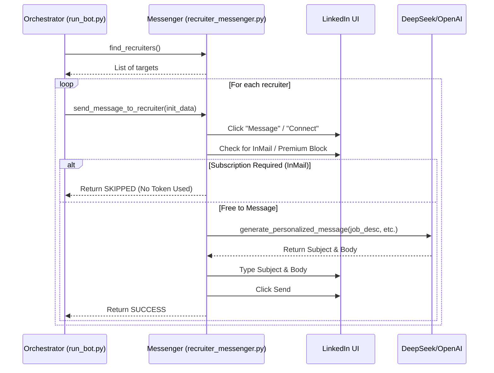

# Directive: Recruiter Messaging

## Goal
Automatically identify and send personalized messages to recruiters on LinkedIn job pages to build connections and improve visibility.

## Inputs
- **Config**: `config/recruiter_messaging.py` for enable/disable, limits, delays.
- **AI Client**: For generating personalized messages (OpenAI, DeepSeek, or Gemini).
- **Job Page**: Current job page with hiring team section.
- **User Information**: Personal details from config for message personalization.

## Tools
- `modules/recruiter_messenger.py`: Functions for finding recruiters, generating messages, sending messages.

## Instructions
1. **Check Configuration**: Verify `enable_recruiter_messaging` is True.
2. **Find Recruiters**: Use `find_recruiters_on_job_page()` to identify potential targets.
3. **Initiate Messaging**: Call `send_message_to_recruiter()` with `init_data` (NOT pre-generated text).
4. **Verify & Generate (Just-in-Time)**:
   - Click "Message" button.
   - **Check**: Is message free? (No InMail required).
   - **If Free**: Call AI to generate message (Consumes Tokens).
   - **If InMail**: Skip immediately (Saves Tokens).
5. **Send**: Type and send the message.
6. **Track Results**: Log all activities.

## Workflow Diagram

## Edge Cases
- **InMail Required**: Skip recruiters who require InMail to preserve credits (and AI tokens).
- **Messaging Bar Full**: Close existing bubbles before opening new ones.
- **AI Failure**: Fall back to template messages if AI generation fails.
- **Rate Limits**: Implement delays between messages.

## Outputs
- **Messages Sent**: Count of successful messages.
- **CSV Log**: Detailed history in `all excels/recruiter_messages_history.csv`.
- **Console Logs**: Debug information for monitoring (includes AI generated text).